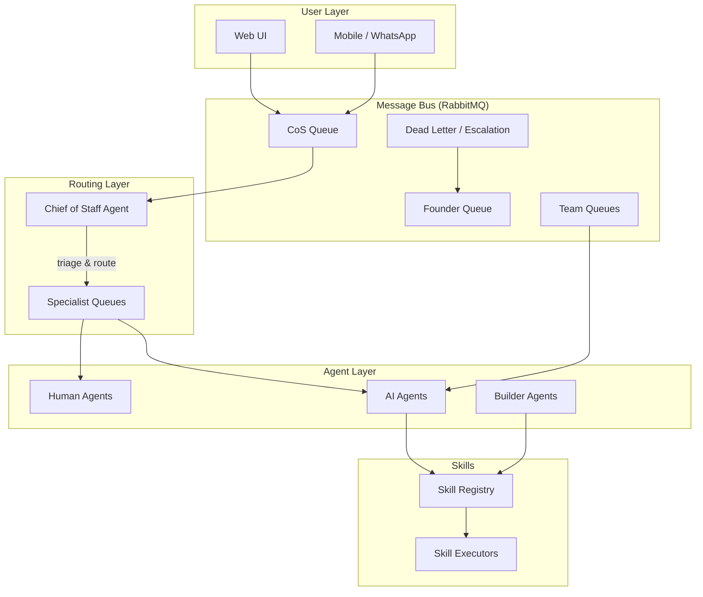

# Cortex

**A Digital Operating System for Your Company**

[](https://github.com/dbhq-uk/cortex/actions/workflows/ci.yml)
[](https://dotnet.microsoft.com/)
[](https://www.gnu.org/licenses/agpl-3.0)

Cortex is an open-source, message-driven framework for running a business through a unified system where humans and AI agents collaborate as equals. Built in C# under the [dbhq-uk](https://github.com/dbhq-uk) organisation.

It is not a chatbot. It is not a coding tool. It is a digital operating system for a company. Every real-world organisational concept -- delegation, authority, dispute resolution, succession, arbitration -- is encoded as executable software.

## Architecture



## Key Concepts

- **Message-driven** -- everything communicates through durable message queues
- **Authority model** -- three tiers (Just Do It, Do It and Show Me, Ask Me First) flowing as claims on every message
- **Humans and AI are interchangeable** -- at the routing layer, a task goes to whoever can do it
- **Everything is a skill** -- skills are markdown files wrapping any capability (C#, Python, CLI, API)
- **Teams self-assemble** -- agents are pulled in based on capability matching, teams dissolve when goals complete
- **Reference codes** -- every thread gets a unique traceable ID (e.g. `CTX-2026-0221-001`)

## Project Structure

```
cortex/
├── src/
│   ├── Cortex.Core/          # Message contracts, authority model, reference codes
│   ├── Cortex.Messaging/     # Message bus abstraction, queue topology
│   ├── Cortex.Agents/        # Agent contracts, delegation tracking
│   ├── Cortex.Skills/        # Skill registry, skill execution contracts
│   └── Cortex.Web/           # Web UI (Phase 1)
├── tests/
│   ├── Cortex.Core.Tests/
│   ├── Cortex.Messaging.Tests/
│   └── Cortex.Agents.Tests/
├── skills/                    # Skill definitions (markdown)
└── docs/
    ├── architecture/          # Vision and architecture docs
    ├── adr/                   # Architecture Decision Records
    └── plans/                 # Design and implementation plans
```

## Getting Started

### Prerequisites

- [.NET 10 SDK](https://dotnet.microsoft.com/download/dotnet/10.0)

### Build

```bash
dotnet restore
dotnet build
```

### Test

```bash
dotnet test
```

## Project Status

**Phase 1 -- The Spine** (active development)

See the [vision document](docs/architecture/vision.md) for the full roadmap.

| Phase | Focus | Status |
|-------|-------|--------|
| Phase 1 | Message bus, agent contracts, CoS, email integration, web UI | In Progress |
| Phase 2 | Dynamic teams, mobile UI, cost tracking, Claude Code integration | Planned |
| Phase 3 | Self-improvement, skill authoring agents, dispute resolution | Planned |
| Phase 4 | Managed service, multi-tenant, productisation | Future |

## Built with AI

This project is developed using AI-assisted workflows, including [Claude Code](https://docs.anthropic.com/en/docs/claude-code) for architecture, implementation, and code review. See [CLAUDE.md](CLAUDE.md) for how AI tooling is integrated into the development process.

AI-assisted contributions are welcome and encouraged.

## Contributing

See [CONTRIBUTING.md](CONTRIBUTING.md) for guidelines on how to contribute.

## License

This project is licensed under the [GNU Affero General Public License v3.0](LICENSE).

Copyright (C) 2026 Daniel Grimes / dbhq-uk
