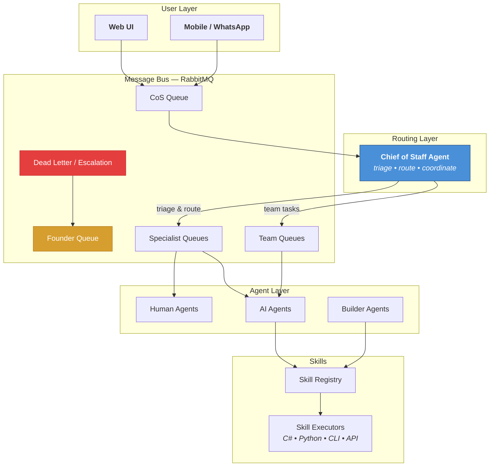

<div align="center">

# Cortex

### A Digital Operating System for Your Company

[](https://github.com/dbhq-uk/cortex/actions/workflows/ci.yml)
[](https://dotnet.microsoft.com/)
[](https://www.rabbitmq.com/)
[](https://www.gnu.org/licenses/agpl-3.0)
[](CONTRIBUTING.md)

**Humans and AI agents, collaborating as equals, running a business through code.**

[Vision](#the-idea) | [Architecture](#architecture) | [Quick Start](#quick-start) | [Roadmap](#roadmap) | [Contributing](#contributing)

</div>

---

## The Idea

Most "AI agent" projects give you a chatbot that calls tools. Cortex is something different.

It's a **message-driven framework** where every real-world organisational concept — delegation, authority, dispute resolution, succession, arbitration — is encoded as executable software. At the routing layer, the system doesn't care if you're human or AI. A task goes to whoever can do it.

> **Not a chatbot. Not a coding tool. A digital operating system for a company.**

<br>

<div align="center">

| Concept | How Cortex Encodes It |
|---|---|
| **Delegation** | Messages flow through queues with authority claims attached |
| **Chain of Command** | Three-tier authority: *Just Do It* → *Do It and Show Me* → *Ask Me First* |
| **Hiring** | Agents register capabilities; teams self-assemble by matching skills to goals |
| **Management** | A Chief of Staff agent triages, routes, and coordinates — never bottlenecks |
| **Accountability** | Every action traced via reference codes (`CTX-2026-0224-001`) |
| **Succession** | Authority can be delegated, inherited, elevated, or revoked at runtime |

</div>

<br>

## Architecture



### How Messages Flow

```
User sends "Draft a reply to the Acme proposal"
  │
  ▼
┌─────────────────────────────────────────────────────┐
│  CoS Queue                                          │
│  ┌───────────────────────────────────────────────┐  │
│  │ MessageEnvelope                               │  │
│  │   Message: "Draft a reply to the Acme..."     │  │
│  │   ReferenceCode: CTX-2026-0224-042            │  │
│  │   Authority: DoItAndShowMe                    │  │
│  │   Context.ReplyTo: agent.cos-agent            │  │
│  │   Context.FromAgentId: web-ui                 │  │
│  └───────────────────────────────────────────────┘  │
└─────────────────────────────────────────────────────┘
  │
  ▼  CoS triages → needs "drafting" capability
  │
┌─────────────────────────────────────────────────────┐
│  Agent Registry                                     │
│  ┌──────────┐  ┌──────────┐  ┌──────────┐         │
│  │ agent-01 │  │ agent-02 │  │ agent-03 │         │
│  │ drafting │  │ research │  │ drafting │         │
│  │ ✅ avail │  │ ❌ busy  │  │ ✅ avail │         │
│  └──────────┘  └──────────┘  └──────────┘         │
└─────────────────────────────────────────────────────┘
  │
  ▼  Routed to agent-01's queue
  │
  Agent processes → returns draft → reply published to CoS
  │
  ▼  Authority = DoItAndShowMe → CoS presents to user for approval
```

<br>

## Key Concepts

<table>
<tr>
<td width="50%">

### Authority Model

Not a simple permission system. Authority **flows as claims on every message** through the queue and can be granted, revoked, or escalated by anyone above.

| Tier | Meaning | Example |
|------|---------|---------|
| **Just Do It** | Internal, no footprint | Log, update, file |
| **Do It and Show Me** | Execute, then present | Draft email, create plan |
| **Ask Me First** | Needs approval first | Send email, spend money |

</td>
<td width="50%">

### Everything is a Skill

Skills are **markdown files** wrapping any capability. Language-agnostic, discoverable, composable — and agents can author new ones.

```markdown
# email-draft
## Trigger
capability: drafting
## Execute
```csharp
var draft = await EmailService
  .AnalyseAndDraft(context);
return draft;
```
```

</td>
</tr>
<tr>
<td>

### Teams Self-Assemble

1. A goal arrives
2. CoS analyses what capabilities are needed
3. Agent registry queried — match by skill, availability, model tier
4. Team created with its own queue topology
5. Work progresses with delegation tracking
6. Team dissolves when goal is complete

</td>
<td>

### Humans = AI

At the routing layer, the system **does not distinguish** between human and AI agents. Both implement `IAgent`. Both consume from queues. Both have capabilities.

```csharp
public interface IAgent
{
    string AgentId { get; }
    string Name { get; }
    IReadOnlyList<AgentCapability> Capabilities { get; }
    Task<MessageEnvelope?> ProcessAsync(
        MessageEnvelope envelope,
        CancellationToken ct = default);
}
```

</td>
</tr>
</table>

<br>

## Quick Start

### Prerequisites

- [.NET 10 SDK](https://dotnet.microsoft.com/download/dotnet/10.0)
- [Docker](https://www.docker.com/) (for RabbitMQ)

### Clone and Build

```bash
git clone https://github.com/dbhq-uk/cortex.git
cd cortex
dotnet restore && dotnet build
```

### Run Tests

```bash
# Unit tests (no dependencies needed)
dotnet test --filter "Category!=Integration"

# Full suite with RabbitMQ integration tests
docker compose up -d
dotnet test
```

### Wire Up the Agent Runtime

```csharp
// Register the message bus
services.AddRabbitMqMessaging(options =>
{
    options.HostName = "localhost";
    options.UserName = "cortex";
    options.Password = "cortex";
});

// Register the agent runtime — starts agents as a hosted service
services.AddCortexAgentRuntime(builder =>
{
    builder.AddAgent<MyCustomAgent>();
});
```

### Create Your First Agent

```csharp
public class GreetingAgent : IAgent
{
    public string AgentId => "greeting-agent";
    public string Name => "Greeting Agent";
    public IReadOnlyList<AgentCapability> Capabilities { get; } =
    [
        new AgentCapability { Name = "greeting", Description = "Greets people" }
    ];

    public Task<MessageEnvelope?> ProcessAsync(
        MessageEnvelope envelope, CancellationToken ct = default)
    {
        // Your agent logic here
        var response = envelope with
        {
            Message = new GreetingResponse { Text = "Hello from Cortex!" }
        };
        return Task.FromResult<MessageEnvelope?>(response);
    }
}
```

The `AgentHarness` handles the rest — queue subscription, reply routing, `FromAgentId` stamping, and registry management.

<br>

## Project Structure

```
cortex/
├── src/
│   ├── Cortex.Core/                # Message contracts, authority, reference codes
│   ├── Cortex.Messaging/           # Message bus abstraction + InMemoryMessageBus
│   ├── Cortex.Messaging.RabbitMQ/  # RabbitMQ implementation (topic exchange, dead letter)
│   ├── Cortex.Agents/              # Agent runtime, harness, registry, delegation
│   ├── Cortex.Skills/              # Skill registry and execution contracts
│   └── Cortex.Web/                 # Web UI (ASP.NET)
├── tests/                          # 74 tests across 4 projects
├── skills/                         # Skill definitions (markdown)
└── docs/
    ├── architecture/               # Vision document
    ├── adr/                        # Architecture Decision Records
    ├── plans/                      # Design and implementation plans
    └── research/                   # Agent orchestration research
```

<br>

## Roadmap

<table>
<tr>
<td align="center" width="25%">

### Phase 1
**The Spine**

*In Progress*

</td>
<td>

- [x] RabbitMQ message bus with topic exchange routing and dead letter escalation
- [x] Agent harness and runtime — per-agent lifecycle, team support, dynamic creation
- [x] Per-consumer lifecycle — `IAsyncDisposable` handles for independent consumer stop
- [x] Reference code generator with persistent sequencing
- [ ] Authority claim validation and enforcement
- [ ] Chief of Staff agent — triage and capability-based routing
- [ ] Email listener (webhook ingest) and email analysis/draft skill
- [ ] Web UI — channel sidebar, chat thread, actions panel

</td>
</tr>
<tr>
<td align="center">

### Phase 2
**Orchestration**

*Planned*

</td>
<td>

- [ ] Task dependency DAG with auto-unblock
- [ ] Broadcast messaging and team fanout
- [ ] Coordination messages — `TaskCompleted`, `PlanApprovalRequest`, `ShutdownRequest`
- [ ] Team lifecycle management — assemble, activate, dissolve
- [ ] Claude Code CLI wrapper for AI agent execution
- [ ] Cost tracking per reference code
- [ ] Mobile UI

</td>
</tr>
<tr>
<td align="center">

### Phase 3
**Intelligence**

*Planned*

</td>
<td>

- [ ] **TeamArchitectAgent** — "build me a team and build this"
- [ ] Orchestration engine — DAG execution, saga patterns, checkpoint/restart
- [ ] Self-improving skills — agents generate new skill definitions
- [ ] Dispute resolution and arbitration
- [ ] Capability-based intelligent routing (availability + load + performance)

</td>
</tr>
<tr>
<td align="center">

### Phase 4
**Product**

*Future*

</td>
<td>

- [ ] Managed service infrastructure and multi-tenant architecture
- [ ] Agent economy — task bidding, reputation scoring
- [ ] Gossip-based agent discovery for multi-instance deployments

</td>
</tr>
</table>

<br>

## What's Built So Far

| Component | Description | Tests |
|-----------|-------------|:-----:|
| **Cortex.Core** | Message contracts, authority model, reference codes with persistent sequencing | 19 |
| **Cortex.Messaging** | `IMessageBus` abstraction, `InMemoryMessageBus` for testing, per-consumer `IAsyncDisposable` lifecycle | 11 |
| **Cortex.Messaging.RabbitMQ** | Full RabbitMQ implementation — topic exchange, dead letter fanout, JSON serialisation with type headers | 13 |
| **Cortex.Agents** | `AgentHarness`, `AgentRuntime` (`IHostedService`), `IAgentRuntime` for dynamic/team agent management, in-memory registry and delegation tracker | 31 |

**74 tests. Zero warnings. Warnings-as-errors enforced.**

<br>

## Built with AI

This project is developed using AI-assisted workflows, including [Claude Code](https://docs.anthropic.com/en/docs/claude-code) for architecture, implementation, and code review. The [research documentation](docs/research/) covers cutting-edge multi-agent orchestration patterns that inform the design.

See [CLAUDE.md](CLAUDE.md) for how AI tooling is integrated into the development process.

AI-assisted contributions are welcome and encouraged.

## Contributing

We'd love your help. See [CONTRIBUTING.md](CONTRIBUTING.md) for guidelines.

**Good first issues:** Check the [open issues](https://github.com/dbhq-uk/cortex/issues) for anything tagged `good first issue`.

## License

[GNU Affero General Public License v3.0](LICENSE) -- Copyright (C) 2026 Daniel Grimes / [dbhq-uk](https://github.com/dbhq-uk)
